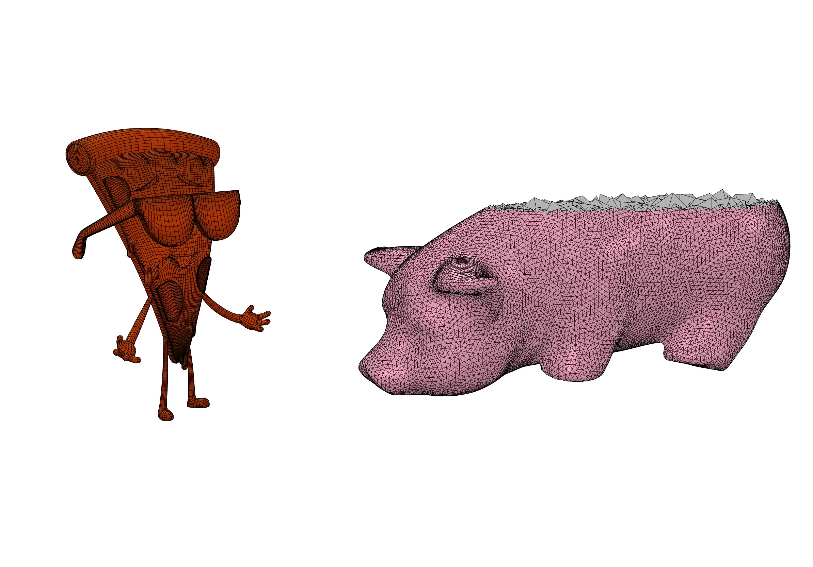

# Pizza3DEngine

Here is my custom 3D engine built in Swift and Metal. 
During my Ph.D., I have received tons of volumetric meshes to visualize and analyze. Sometimes I couldn't promptly go to my computer station to open the mesh with a desktop app, but, in all these cases, I had my iPad with me. I decided to build an app for the iPad capable of opening both surface and volumetric meshes, with some useful functionalities like slicing, digging, picking, etc. I started from scratch by building this library first. You can find the iPad app at this [link](https://linktoapp).

<p align="center"></p>

## Usage

The main elements of this library are:

- Canvas:   The view where the 3D objects are drawn on
- Scene:    The container of all the 3D objects
- Drawable: An object that can be drawn on the Canvas
- Renderer: The class that draws the scene on the Canvas

An example of how to build a simple scene can be found below:

``` swift
import UIKit
import Pizza3DEngine

class CanvasViewController : UIViewController, RendererDelegate {
    
    var canvas : Canvas!
    var renderer : Renderer!
    var scene : Scene!

    func buildScene() -> Scene{

        let verts = [vec3(-0.5,-0.5,0.5), vec3(0.5,-0.5,0.5), vec3(0.5,-0.5,-0.5), vec3(-0.5,-0.5,-0.5),
                     vec3(-0.5,0.5,0.5), vec3(0.5,0.5,0.5), vec3(0.5,0.5,-0.5), vec3(-0.5,0.5,-0.5)]
        let polys : [[Int]] = [[0,1,2,3,4,5,6,7]]
        
        var mesh = HexMesh(vertices: verts, polys: polys, labels: nil)
        var drawableMesh : DrawableMesh(mesh: mesh)

        let scene = Scene()
        let camera = Camera(settings: PerspectiveSettings.defaultSettings())

        camera.position = vec3(0,0,-3)
        camera.rotation = vec3(0,0,0)
        
        scene.camera = camera
        let s = 1.0 / drawableMesh.geometry.bbox.diag
        drawableMesh.scale = vec3(s,s,s)
        drawableMesh.position -= drawableMesh.geometry.bbox.center
        drawableMesh.material.ambient = vec3(1,1,1)
        drawableMesh.material.shininess = 32
        drawableMesh.material.specular = vec3(1,1,1)
        drawableMesh.material.model = .phong

        drawableMesh.wireframeEnabled = true
        
        scene.rootNode.add(child: drawableMesh)
        
        let ambient = AmbientLight()
        ambient.color = vec3(1,1,1)
        ambient.intensity = 0.7
        
        let light = PointLight()
        light.position = vec3(-2,2,2)
        light.color = vec3(1,1,1)
        light.intensity = 0.4

        scene.rootNode.add(child: light)        
        scene.rootNode.add(child: ambient)

        return scene

    }

    override func viewDidLoad() {
        super.viewDidLoad()
        
        guard let mtkView = self.view as? Canvas else{
            print("view is not a metal view")
            return
        }
        canvas = mtkView
        scene = buildScene()
        renderer = Renderer(canvas: canvas, scene: scene)
        canvas.delegate = renderer
        renderer.delegate = self
        canvas.showFPS = false
    }

}

```

## Installation

This package can be installed with the Swift Package Manager:

``` swift
dependencies: [
    .package(url: "https://github.com/pizza1994/Pizza3DEngine", from: "1.0.1")
]
```

## Requirements

- iPadOS 14.0+
- Xcode 12


